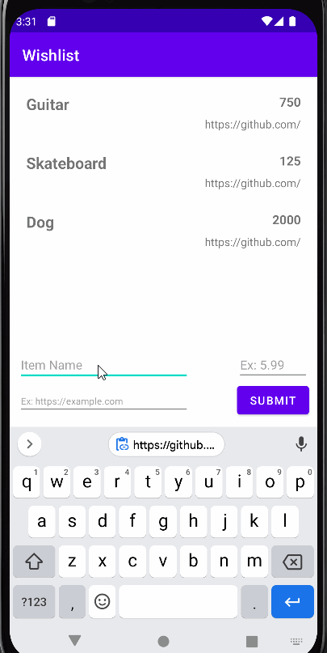

# Android Project 2 - *Simple Wishlist*

Submitted by: **Robinson Ibarra**

**Simple Wishlist** is a wishlist app that helps the user keep track of what they want to buy.

Time spent: **8** hours spent in total

## Required Features

The following **required** functionality is completed:

- [X] **User can add an item to their wishlist**
- [X] **User can see their list of items based on previously inputted items**

## Video Walkthrough

Here's a walkthrough of implemented user stories:

<!-- Replace this with whatever GIF tool you used! -->
GIF created with [LiceCap](http://www.cockos.com/licecap/). 
<!-- Recommended tools:
[Kap](https://getkap.co/) for macOS
[ScreenToGif](https://www.screentogif.com/) for Windows
[peek](https://github.com/phw/peek) for Linux. -->

## Notes

I had issues with having my input dashboard not disappear underneath my keyboard when I was choosing different
inputs for information.

Issue I could not resolve was not being able to input a decimal on the number keyboard. 

I wanted to make the application not so involved in the onCreate function, but it wound up not being too messy
or that many lines of code.

## License

    Copyright [2022] [Robinson Ibarra]

    Licensed under the Apache License, Version 2.0 (the "License");
    you may not use this file except in compliance with the License.
    You may obtain a copy of the License at

        http://www.apache.org/licenses/LICENSE-2.0

    Unless required by applicable law or agreed to in writing, software
    distributed under the License is distributed on an "AS IS" BASIS,
    WITHOUT WARRANTIES OR CONDITIONS OF ANY KIND, either express or implied.
    See the License for the specific language governing permissions and
    limitations under the License.
